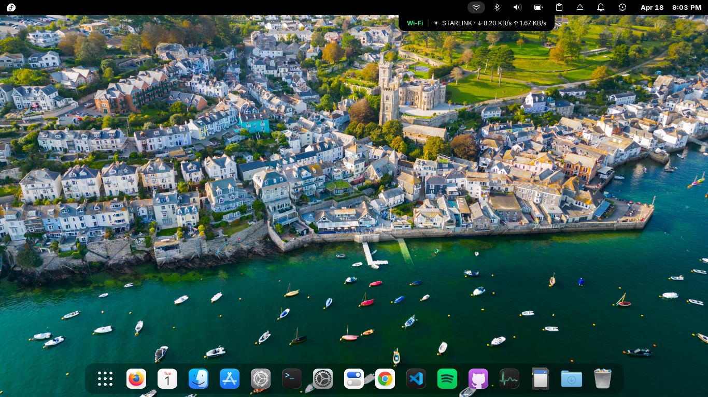
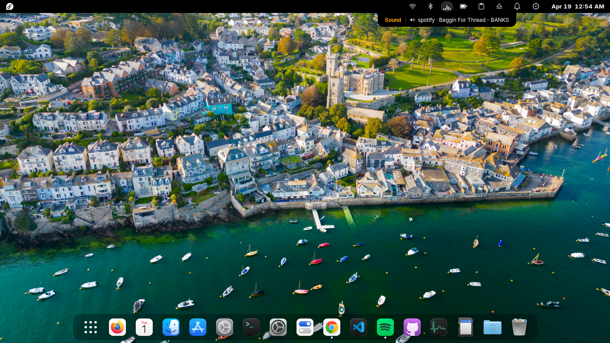
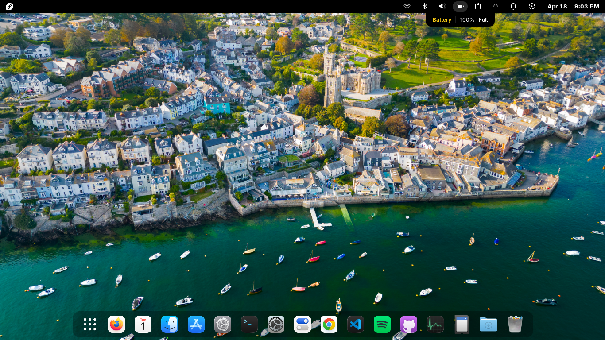

# Separate Quick Toggles

A GNOME Shell extension that replaces the default combined Quick Settings panel with individual, customizable status indicators on the top bar.

## Screenshots

### Wi-Fi — hover pocket showing SSID and live throughput


### Bluetooth — hover pocket showing connected device and battery


### Sound — hover pocket showing current media track


### Sound — hover pocket with animated music visualizer while playing


### Battery — hover pocket showing charge level and status


---

## Features

- **Separate Indicators** — Replaces the default Wi-Fi/sound/battery button with individual icons for Wi-Fi, Bluetooth, Sound, Battery, and Notifications
- **Hover Pockets** — Hovering any indicator shows a floating tooltip with live status (SSID + speed, device name, track info, battery %, etc.)
- **Dynamic Wi-Fi Icon** — Reflects real-time signal strength: offline, disconnected, weak, ok, good, excellent
- **Music Visualizer** — Animated bars on the Sound pocket while media is playing
- **Customizable Order** — Drag and drop to reorder panel indicators in preferences
- **Show/Hide Toggles** — Enable or disable individual indicators as needed
- **Compact Mode** — Single ☰ icon combining all indicators into one menu
- **Clock Position** — Move the clock/date display to the left, center, or right of the top bar
- **Hide Activities Button** — Optionally remove the Activities button from the top bar
- **Battery Percentage** — Optional percentage label next to the battery icon
- **Single Quick Settings Icon** — The default GNOME Quick Settings button is replaced with a compact gear icon

## Installation

1. Clone or download this extension to your GNOME extensions directory:
   ```bash
   ~/.local/share/gnome-shell/extensions/separate-quick-toggles@extension/
   ```

2. Compile the schema:
   ```bash
   glib-compile-schemas ~/.local/share/gnome-shell/extensions/separate-quick-toggles@extension/schemas/
   ```

3. Enable the extension:
   ```bash
   gnome-extensions enable separate-quick-toggles@extension
   ```

4. Restart GNOME Shell or log out and back in:
   - Press `Alt`+`F2`, type `r`, and press Enter (X11 only)
   - Or log out and back in (Wayland)

## Configuration

Open GNOME Settings → **Extensions** → **Separate Quick Toggles** to configure:

- **Panel Indicators** — Reorder and toggle visibility of individual indicators
- **Compact Mode** — Enable single-icon compact mode
- **Battery** — Show or hide the percentage label

## Indicators

### Wi-Fi
- Dynamic icon reflects current signal strength
- Hover to see SSID and live download/upload speed
- Click to open the Wi-Fi menu with a toggle switch, available networks list, and a refresh button
- Async network scanning — no UI freezes

### Bluetooth
- Shows Bluetooth on/off status
- Hover to see the connected device name and battery level
- Click to open the Bluetooth menu with a toggle switch and paired devices list
- Click a device to connect to it

### Sound
- Hover to see current volume or the playing track (artist · title)
- Animated visualizer bars in the hover pocket while media is playing
- Click to open the Sound menu with a volume slider, per-device mute circle button (blue = active, grey = muted), and output device picker

### Battery
- Displays current battery percentage and charging status
- Hover to see charge percentage and state (charging, discharging, full)
- Optional percentage label on the panel
- Click to open the Battery menu with time-remaining estimate

### Notifications
- Badge shows the number of pending notifications
- Click to open the GNOME notification panel (the same one in the clock dropdown)

## Files

- `extension.js` — Extension lifecycle and panel wiring
- `prefs.js` — Preferences/settings UI
- `lib/utils.js` — Shared process/D-Bus/menu helper functions
- `lib/volume-slider.js` — Reusable custom volume slider widget
- `ui/compact-indicator.js` — Compact mode indicator/menu
- `ui/wifi-indicator.js` — Wi-Fi standalone indicator
- `ui/bluetooth-indicator.js` — Bluetooth standalone indicator
- `ui/sound-indicator.js` — Sound standalone indicator
- `ui/battery-indicator.js` — Battery standalone indicator
- `ui/notification-indicator.js` — Notification standalone indicator
- `ui/indicators.js` — Indicator factory for runtime creation
- `ui/pocket.js` — Floating hover pocket widget
- `stylesheet.css` — Visual styling
- `metadata.json` — Extension metadata
- `schemas/org.gnome.shell.extensions.separate-quick-toggles.gschema.xml` — GSettings schema

## Troubleshooting

**Indicators don't appear after installation:**
1. Compile the schema: `glib-compile-schemas ~/.local/share/gnome-shell/extensions/separate-quick-toggles@extension/schemas/`
2. Restart GNOME Shell (`Alt`+`F2` → `r` → Enter, X11 only) or log out/in
3. Check the extension is enabled in GNOME Settings

**Wi-Fi icon isn't updating:**
- Ensure NetworkManager is installed and running
- The icon updates based on the active access point signal strength via D-Bus

**Bluetooth devices not connecting:**
- Ensure `bluetoothctl` is available (`bluez` package)
- Devices must be paired before they appear in the list

## Requirements

- GNOME Shell 45 or later
- NetworkManager (Wi-Fi indicator)
- BlueZ / `bluetoothctl` (Bluetooth indicator)
- PulseAudio / PipeWire + `pactl` (Sound indicator)
- Compatible with both X11 and Wayland

## License

This extension is provided as-is for personal use.
